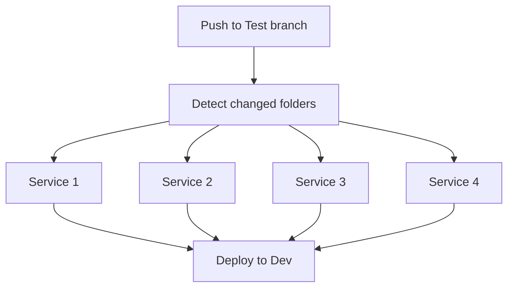

# Workflow Diagrams

This document describes the flow in `.github/workflows/multifolder.yml`.

## Simplified Flow Diagram



## Detailed Flow Diagram

```mermaid
flowchart TD
  A[push on branch Test] --> B[Job: detect_changes\ncheckout + dorny/paths-filter]

  B -->|folder1 == true| C1[Job: test_folder1\nname: Service 1\nuses: ci_service_1.yml]
  B -->|folder2 == true| C2[Job: test_folder2\nname: Service 2\nuses: ci_service_2.yml]
  B -->|folder3_test3 == true| C3[Job: test_folder3_test3\nname: Service 3\nuses: ci_service_3.yml]
  B -->|folder3_test4 == true| C4[Job: test_folder3_test4\nname: Service 4\nuses: ci_service_4.yml]

  C1 --> E[ECS-Deploy-Dev]
  C2 --> E
  C3 --> E
  C4 --> E

  C1 -. skipped .-> E
  C2 -. skipped .-> E
  C3 -. skipped .-> E
  C4 -. skipped .-> E

  E -->|always() AND any service succeeded| F[Deploy to Dev environment]
```
